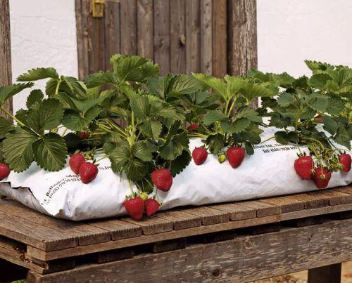

# 🍓 Strawberry Detection with Depth Estimation

A Python tool for detecting and segmenting strawberries in images with accurate depth (distance) estimation using Depth-Anything-V2.



## Features

- 🍓 **Strawberry Detection** - YOLOv8-based detection and instance segmentation
- 📏 **Metric Depth Estimation** - Distance in meters using Depth-Anything-V2
- 📊 **Rich Output** - Bounding boxes, segmentation masks, depth statistics
- 💾 **Multiple Output Formats** - JSON, NumPy arrays (.npy), visualization images
- 🐍 **Python API** - Use as a library in your code
- 💻 **CLI Tool** - Run from command line
- 📁 **Batch Processing** - Process entire folders of images

## Installation

```bash
# Clone the repository
git clone https://github.com/SergKurchev/strawberry_detector.git
cd strawberry_detector

# Install dependencies
pip install -r requirements.txt
```

> **Note:** Models (~1.3 GB) will be downloaded automatically on first run.

## Quick Start

### Python API

```python
from strawberry_detector import detect, StrawberryDetector

# Quick one-liner detection
result = detect("test_images/strawberries_sample.jpg")
print(f"Found {result['detections_count']} strawberries")

# Access detection details
for det in result['detections']:
    print(f"  ID {det['id']}: {det['class_name']}, "
          f"distance={det['depth']['mean_cm']:.1f} cm")
```

### Command Line

```bash
# Basic detection (JSON output only)
python -m strawberry_detector --image test_images/strawberries_sample.jpg --output results.json

# Full output with visualization
python -m strawberry_detector --image test_images/strawberries_sample.jpg --output results/ --save-full

# Process folder of images
python -m strawberry_detector --folder test_images/ --output results/ --save-full --visualize
```

## Usage Examples

### 1. Basic Detection (JSON only)

```python
from strawberry_detector import detect

result = detect("test_images/strawberries_sample.jpg")

# Result contains:
# - image_path, image_size
# - detections_count
# - detections (list with bbox, mask polygon, depth info)
# - statistics (ripe/unripe count, closest/furthest distance)
```

### 2. Full Detection with Saved Files

```python
from strawberry_detector import StrawberryDetector

detector = StrawberryDetector()

# Saves: JSON + depth.npy + masks.npy + visualization
result = detector.detect_and_save_full(
    "test_images/strawberries_sample.jpg",
    output_dir="results/"
)

# Access saved file paths
print(result['output_files'])
# {
#   'depth_map': 'results/strawberries_sample_depth.npy',
#   'masks_combined': 'results/strawberries_sample_masks_combined.npy',
#   'individual_masks': ['results/strawberries_sample_mask_0.npy', ...],
#   'visualization': 'results/strawberries_sample_vis.jpg',
#   'json': 'results/strawberries_sample.json'
# }
```

### 3. Batch Processing

```python
from strawberry_detector import StrawberryDetector

detector = StrawberryDetector()

# Process all images in a folder
results = detector.detect_folder(
    "test_images/",
    output_folder="results/",
    save_full=True,      # Save masks and depth maps
    visualize=True       # Save visualization images
)

print(f"Processed {len(results)} images")
```

### 4. Load Saved NumPy Arrays

```python
import numpy as np

# Load depth map (values in meters)
depth = np.load("results/strawberries_sample_depth.npy")
print(f"Depth range: {depth.min():.2f}m - {depth.max():.2f}m")

# Load combined masks (each strawberry has unique ID)
masks = np.load("results/strawberries_sample_masks_combined.npy")
print(f"Strawberry IDs in mask: {np.unique(masks)}")

# Load individual mask
mask_0 = np.load("results/strawberries_sample_mask_0.npy")
```

## CLI Reference

```
python -m strawberry_detector [OPTIONS]

Input (one required):
  --image, -i PATH    Path or URL to input image
  --folder, -f PATH   Path to folder containing images

Output:
  --output, -o PATH   Output path (required)
                      - For basic mode: JSON file path
                      - For --save-full or batch: folder path

Options:
  --visualize, -v     Save visualization image(s)
  --save-full         Save full output: JSON + depth.npy + masks.npy
  --conf, -c FLOAT    Confidence threshold (default: 0.25)
  --device DEVICE     Force device: 'cuda' or 'cpu'
```

### Examples

```bash
# Single image - JSON only
python -m strawberry_detector -i test_images/strawberries_sample.jpg -o result.json

# Single image - Full output
python -m strawberry_detector -i test_images/strawberries_sample.jpg -o results/ --save-full

# Folder - Full output with visualization
python -m strawberry_detector -f test_images/ -o results/ --save-full -v

# From URL
python -m strawberry_detector -i "https://example.com/image.jpg" -o results/ --save-full
```

## Output Format

### JSON Structure

```json
{
  "image_path": "test_images/strawberries_sample.jpg",
  "image_size": {"width": 500, "height": 403},
  "detections_count": 11,
  "detections": [
    {
      "id": 0,
      "class_id": 1,
      "class_name": "ripe_strawberry",
      "confidence": 0.95,
      "bbox": {
        "x1": 321, "y1": 208, "x2": 348, "y2": 238,
        "width": 27, "height": 30,
        "center_x": 335, "center_y": 223
      },
      "mask": {
        "polygon": [[327, 206], [327, 208], ...],
        "area": 750
      },
      "depth": {
        "mean_meters": 0.88,
        "mean_cm": 88.0,
        "min_meters": 0.86,
        "max_meters": 0.96,
        "median_meters": 0.87,
        "std_meters": 0.02,
        "center_meters": 0.86
      }
    }
  ],
  "statistics": {
    "total_ripe": 11,
    "total_unripe": 0,
    "closest_strawberry_id": 3,
    "closest_distance_cm": 76.2,
    "furthest_strawberry_id": 10,
    "furthest_distance_cm": 97.0
  },
  "output_files": {
    "depth_map": "results/strawberries_sample_depth.npy",
    "masks_combined": "results/strawberries_sample_masks_combined.npy",
    "individual_masks": ["results/strawberries_sample_mask_0.npy", ...],
    "visualization": "results/strawberries_sample_vis.jpg"
  }
}
```

### NumPy Output Files

| File | Description | Shape | Values |
|------|-------------|-------|--------|
| `*_depth.npy` | Depth map | (H, W) | Distance in meters (float32) |
| `*_masks_combined.npy` | All masks | (H, W) | Strawberry ID (0=background, 1,2,3...=strawberry IDs) |
| `*_mask_{id}.npy` | Individual mask | (H, W) | Binary mask (0 or 255) |

## Models

| Model | Purpose | Size | Source |
|-------|---------|------|--------|
| Depth-Anything-V2 ViT-L | Metric depth estimation | ~1.3 GB | [HuggingFace](https://huggingface.co/depth-anything/Depth-Anything-V2-Metric-Hypersim-Large) |
| YOLOv8 Strawberry | Detection & segmentation | ~50 MB | Custom trained |

Models are downloaded automatically to `checkpoints/` on first run.

## Requirements

- Python 3.8+
- PyTorch 2.0+
- CUDA (optional, for GPU acceleration)

See `requirements.txt` for full list.

## Project Structure

```
strawberry_detector/
├── strawberry_detector/          # Python package
│   ├── __init__.py               # Package exports
│   ├── __main__.py               # CLI entry point
│   ├── config.py                 # Configuration & paths
│   ├── depth.py                  # Depth-Anything-V2 wrapper
│   ├── detector.py               # Main StrawberryDetector class
│   ├── models.py                 # Model downloading
│   ├── segmentation.py           # YOLOv8 wrapper
│   └── utils.py                  # Image loading, visualization
├── test_images/                  # Sample images for testing
│   └── strawberries_sample.jpg
├── examples/
│   └── example.py                # Usage examples
├── checkpoints/                  # Model weights (auto-downloaded)
├── requirements.txt
├── setup.py
└── README.md
```

## License

MIT License
